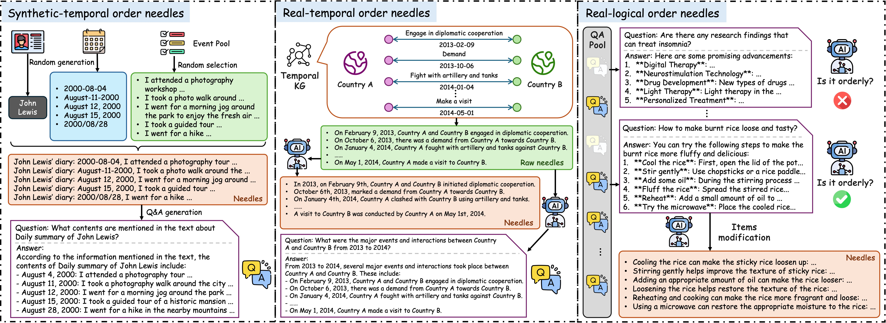
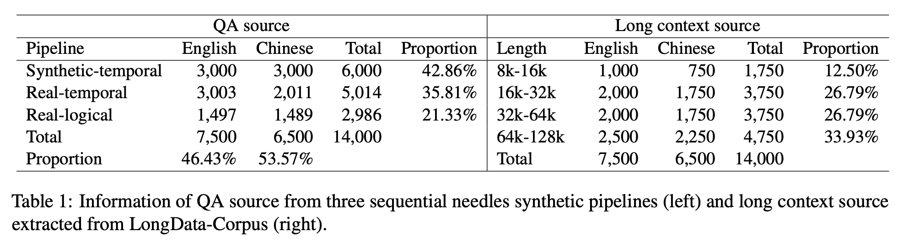

# Sequential-NIAH-Benchmark
Sequential-NIAH: A Needle-In-A-Haystack Benchmark for Extracting Sequential Needles from Long Contexts

## Introduction
Evaluating the ability of large language models (LLMs) to handle extended contexts is critical, particularly for retrieving information relevant to specific queries embedded within lengthy inputs. We introduce **Sequential-NIAH**, a benchmark specifically designed to evaluate the capability of LLMs to extract sequential information items (known as *needles*) from long contexts. The benchmark comprises three types of needle generation pipelines: synthetic, real, and open-domain QA. It includes contexts ranging from 8K to 128K tokens in length, with a dataset of 14,000 samples (2,000 reserved for testing). To facilitate evaluation on this benchmark, we trained a synthetic data-driven evaluation model capable of evaluating answer correctness based on chronological or logical order, achieving an accuracy of 99.49% on synthetic test data. We conducted experiments on six well-known LLMs, revealing that even the best-performing model achieved a maximum accuracy of only 63.15%. Further analysis highlights the growing challenges posed by increasing context lengths and the number of needles, underscoring substantial room for improvement. Additionally, noise robustness experiments validate the reliability of the benchmark, making Sequential-NIAH an important reference for advancing research on long text extraction capabilities of LLMs.

## Example

You can run the script: `Sequential_NIAH_building_PPL.py` to build the example data (saved in `data/example`). A more intuitive example is as shown in <a href="#example">Figure 1</a>.

<figure id="example">
  
  <figcaption>Figure 1. Sequential-NIAH example of a long text with shuffled needles.</figcaption>
</figure>

## Data Generation Pipelines

### QA Source

We propose three synthesis pipelines for sequential *needles*, as shown in <a href="#pipelines">Figure 2</a>., which are used to build the question with sequential answer items (**Sequential QA**), including:

- synthetic needles (synthetic events in chronological order)
- real needles (real events in chronological order)
- open-domain QA needles (answer items in logical order)

All are ultimately presented in the form of a question with multiple answer items (*needles*) inserted into a long text that meets specific length requirements. 

<figure id="pipelines">
  
  <figcaption>Figure 2. Three pipelines for sequential needles synthesis. Synthetic needles are generated by fake entities, time, and events (left). Real needles are generated from the TKG (right). Open-domain QA needles are generated from a private open-domain QA resource (bottom).</figcaption>
</figure>

### Long Context Source

To enhance the authenticity of the task, we use [LongData-Corpus](https://huggingface.co/datasets/yuyijiong/LongData-Corpus), a real long text corpus, to construct the **Long Context Source**. The corpus contains more than 100k pieces of Chinese and English long texts with lengths exceeding 8k characters, with the longest text exceeding 256k characters. The text content covers a wide range of materials such as academic papers, novels, legal documents, news, patents, government work reports, etc. This provides ample long context data for the construction of the benchmark. When preparing the long context source, to keep the language and quantity of long texts consistent with the QA source, we randomly sample long texts within different token length ranges for each language (Chinese and English), as shown in Table 1. This forms a long context source that covers a wide enough range of topics, has a reasonable distribution of article lengths, and can match each QA pair in the QA source one-to-one.

## File Structure

1. `data/`: the data folder contains the test data of the benchmark and several data examples.
    - `data/example/`: some Sequential-NIAH examples generated by `Sequential_NIAH_building_PPL.py`.
    - `data/source/`: the source data used for generating the benchmark (QA source and Long text source).
    - `data/test_data/test_data_for_infer.jsonl`: the all test data of the benchmark. Each line's "`question`" field is the task's query. "`gt_answer`" field is the ground truth answer. (Due to file size limitations, only 100 samples are uploaded for reference.)
    - `data/noise_test_data/noise_test_data_for_infer.jsonl`: the all test data of the benchmark with noise. Each line's "`question`" field is the task's query. "`gt_answer`" field is the ground truth answer. The noise data can be generated by `Sequential_NIAH_building_PPL_with_noise.py`. (Due to file size limitations, only 18 samples are generated for reference.)
2. `figures/`: the figures folder contains some illustrations and result analysis diagrams.
3. `results/`: the results folder contains the LLMs' outputs of test data and noise test data of the benchmark. Only the results of Qwen2.5 and Llama3.3 have been publicly disclosed; the results of other closed-source models are not publicly disclosed yet.